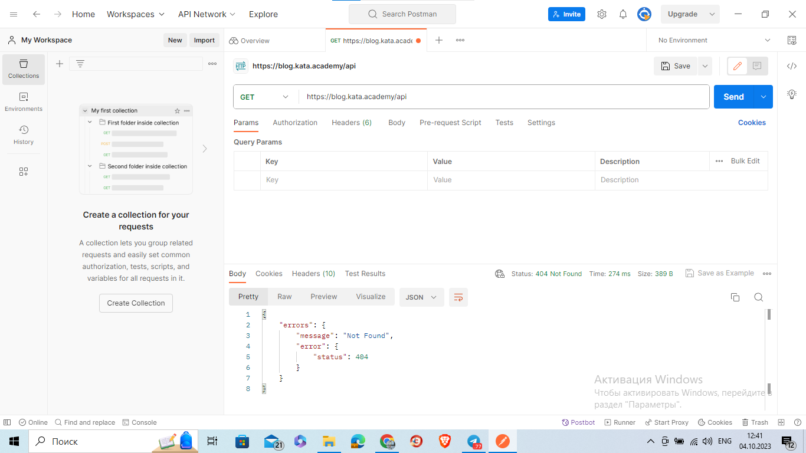
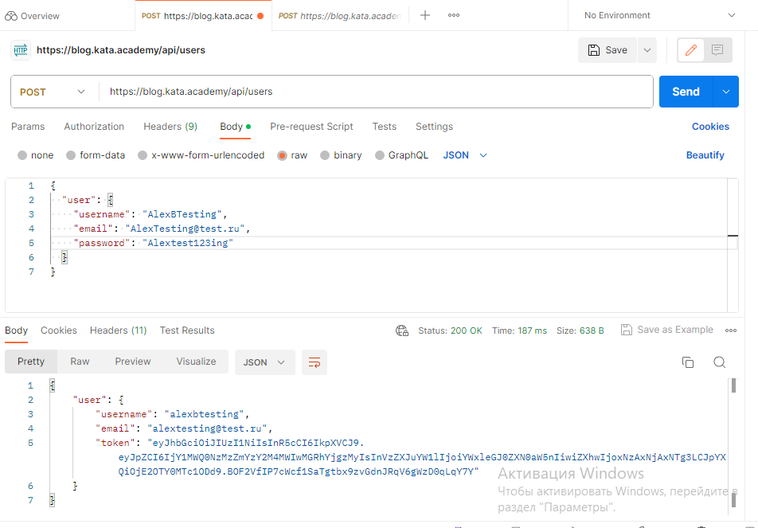
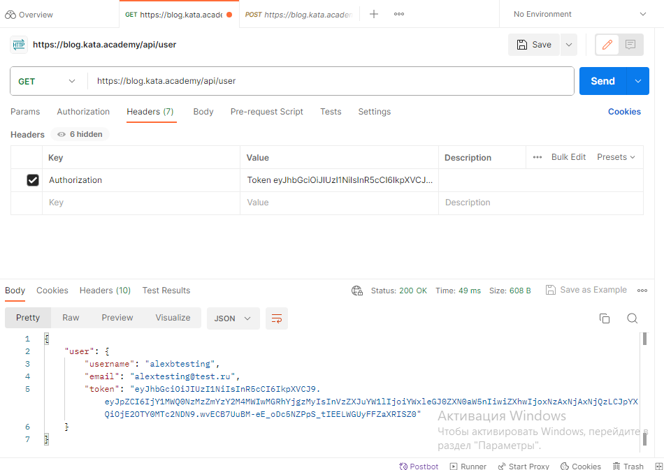

# Postman

1. В поле "Enter" вводим базовый URL API - https://blog.kata.academy/api. Нажимаем кнопку "Send".
2. В ответ получаем JSON с ошибкой, так как не указали endpoint для запроса.


3. Открываем документацию API (https://api.realworld.io/api-docs/) и выбираем интересующий нас endpoint. Например, для регистрации это будет "POST /users"
4. В поле "Enter request URL" вводим базовый URL API - https://blog.kata.academy/api/users. В выпадающем меню выбираем метод "POST".
5. В разделе "Body" выбираем формат данных "JSON (application/json)".
6. В поле для ввода данных в формате JSON вводим необходимые параметры для аутентификации пользователя, например:
Функция ```console.log()```
выводит текст в консоль.

Сумму двух переменных
можно вывести так:
```javascript
{
    "user": {
        "username": "AlexTesting",
        "email": "testing@test.ru",
        "password": "test123ing"
    }
}
```

7. Нажимаем кнопку "Send". В ответ получаем JSON с данными о залогиненном пользователе, включая токен авторизации.


8. Для получения данных текущего пользователя выбираем в документации endpoint "GET /user"
9. В поле "Enter request URL" вводим базовый URL API - https://blog.kata.academy/api/user. В выпадающем меню выбираем метод "GET".
10. В разделе "Headers" добавляем новый заголовок с ключом "Authorization" и значением "Token <ваш_токен_авторизации>", полученным после успешной аутентификации.
11. Нажимаем кнопку "Send". В ответ получаем JSON с данными о текущем пользователе.
